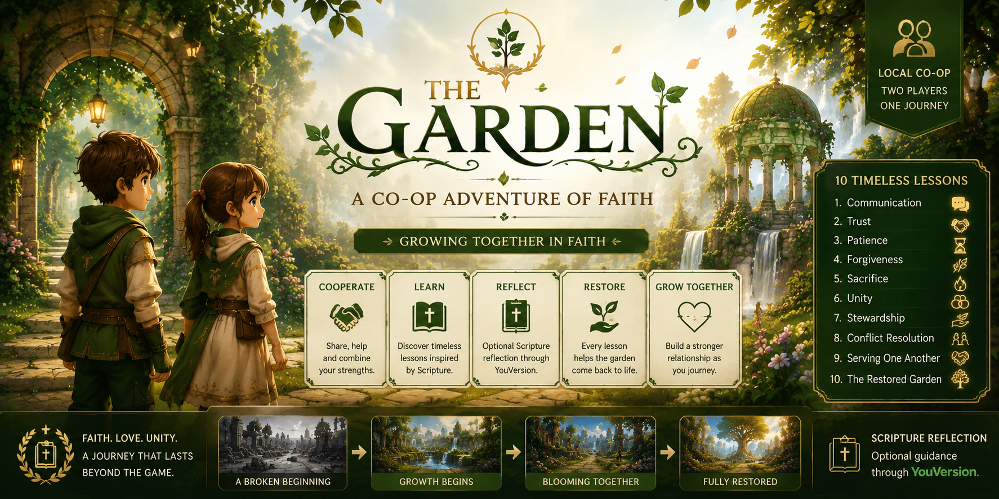

# 🌿 The Garden

<p align="center">
  
</p>

<h3 align="center">
Faith-Inspired Cooperative Puzzle Adventure
</h3>

<p align="center">
Restore a broken world through teamwork, faith, and immersive 3D puzzle solving.
</p>

<p align="center">
Built with <b>React</b> • <b>TypeScript</b> • <b>Three.js</b> • <b>React Three Fiber</b> • <b>Vite</b>
</p>

---

# 📖 About The Garden

**The Garden** is a browser-based cooperative puzzle adventure where two players journey together through a once-beautiful garden that has fallen into darkness.

Instead of telling a story through dialogue alone, the game teaches timeless biblical relationship virtues through interactive gameplay. Every puzzle encourages players to communicate, trust one another, cooperate, and grow together.

Players restore different parts of the garden while progressing through symbolic chapters representing important relationship values.

---

# ✨ Features

- 🌿 Beautiful stylized 3D environments
- 👥 Local cooperative gameplay
- 🎮 Third-person character controller
- 🎭 Animated playable characters
- 🧩 Interactive environmental puzzles
- 🎵 Original ambient background music
- 🌸 Dynamic vegetation and nature
- 📖 Scripture-inspired storytelling
- ❤️ Faith-centered relationship themes
- ⚡ Browser-based experience

---

# 🌱 Current Prototype

This submission includes:

- ✅ Garden Hub
- ✅ Character Selection
- ✅ Communication Chapter
- ✅ Trust Chapter
- ✅ Dynamic Third-Person Camera
- ✅ Animated Characters
- ✅ Interactive Puzzle System
- ✅ Environmental Audio
- ✅ Rich Nature Environment
- ✅ Technical foundation for future chapters

---

# 🌟 Complete Vision

The complete game is planned to contain ten symbolic chapters.

| Chapter | Theme |
|---------|------|
| 1 | Communication |
| 2 | Trust |
| 3 | Patience |
| 4 | Forgiveness |
| 5 | Sacrifice |
| 6 | Unity |
| 7 | Stewardship |
| 8 | Conflict Resolution |
| 9 | Serving One Another |
| 10 | The Restored Garden |

Each chapter introduces a unique cooperative mechanic inspired by its biblical theme, encouraging teamwork, empathy, and reflection rather than competition.

---

# 🎮 Controls

| Key | Action |
|------|--------|
| W A S D | Move |
| Mouse | Rotate Camera |
| Space | Jump |
| E | Interact |

---

# 🛠️ Technology Stack

## Frontend

- React
- TypeScript
- Vite
- React Three Fiber
- Three.js

## 3D

- GLTF / GLB Models
- Character Animation
- Environmental Lighting
- Custom Terrain
- Dynamic Vegetation

## Backend

- Java
- Spring Boot

---

# 🚀 Getting Started

Clone the repository

```bash
git clone https://github.com/PreetiDhotmal/The-Garden.git
```

Install dependencies

```bash
npm install
```

Run the development server

```bash
npm run dev
```

Open your browser

```
http://localhost:5173
```

---

# 📷 Screenshots

## Garden Hub

(Add Screenshot)

---

## Communication Chapter

(Add Screenshot)

---

## Trust Chapter

(Add Screenshot)

---

## Environment

(Add Screenshot)

---

# 🎯 Project Goal

The Garden explores how interactive experiences can communicate values of faith, love, trust, forgiveness, cooperation, and hope.

Rather than presenting lessons through traditional storytelling, players experience these values firsthand by solving cooperative puzzles together and restoring a broken world.

---

# 📂 Repository Structure

```
frontend/
backend/
packages/
public/
models/
audio/
```

---

# 🚀 Future Roadmap

- Remaining 8 Chapters
- More Puzzle Mechanics
- Additional Characters
- Save System
- Multiplayer Networking
- Improved AI
- Accessibility Features
- Mobile Optimization

---

# 👩‍💻 Author

**Preeti Dhotmal**

GitHub:
https://github.com/PreetiDhotmal

---

# 📄 License

This project is licensed under the MIT License.

---

# 🙏 Acknowledgements

Created for the Kaggle Game Arena Challenge.

Special thanks to the open-source community and the tools that made this project possible.

> *Growing Together in Faith.*
