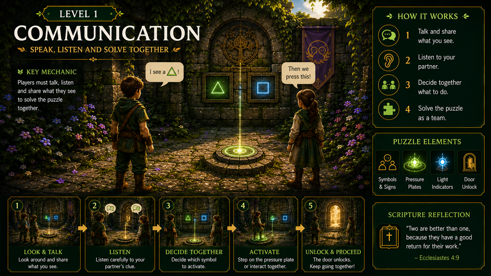
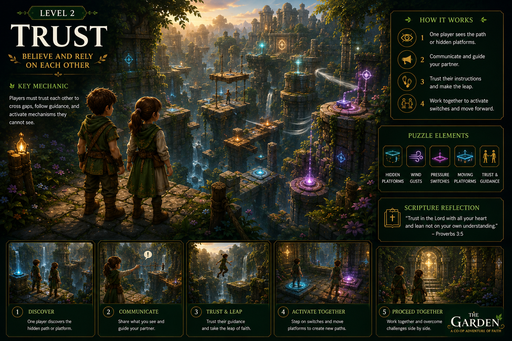
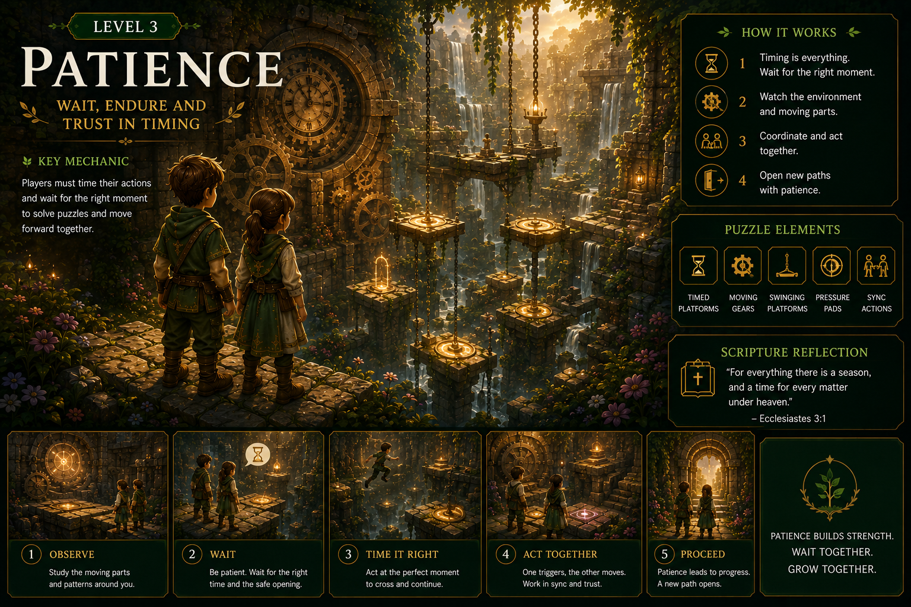
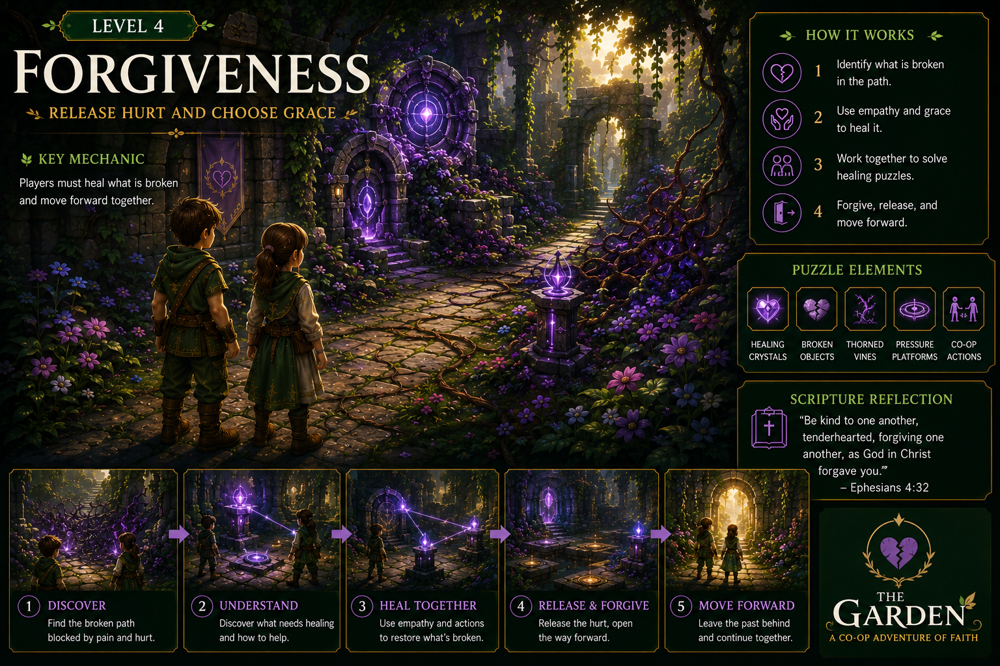
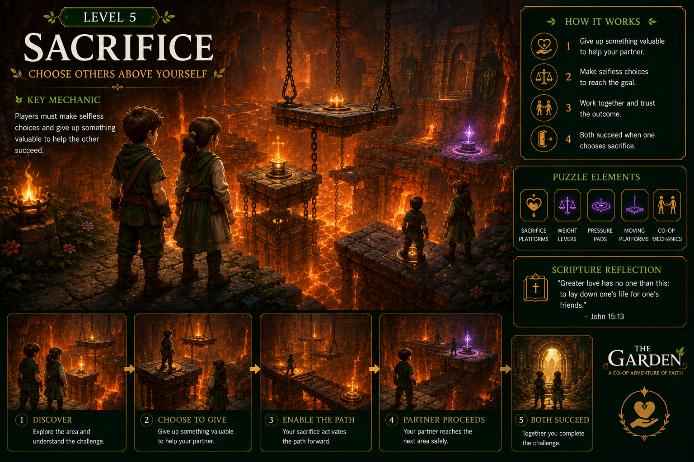

# 🌿 The Garden

<p align="center">
  
</p>

<h3 align="center">
Faith-Inspired Cooperative Puzzle Adventure
</h3>

<p align="center">
Restore a broken world through teamwork, faith, and immersive 3D puzzle solving.
</p>

<p align="center">
Built with <b>React</b> • <b>TypeScript</b> • <b>Three.js</b> • <b>React Three Fiber</b> • <b>Vite</b>
</p>

---

# 📖 About The Garden

**The Garden** is a browser-based cooperative puzzle adventure where two players journey together through a once-beautiful garden that has fallen into darkness.

Instead of telling a story through dialogue alone, the game teaches timeless biblical relationship virtues through interactive gameplay. Every puzzle encourages players to communicate, trust one another, cooperate, and grow together.

Players restore different parts of the garden while progressing through symbolic chapters representing important relationship values.

---

## Features

- 🌿 Browser-based 3D cooperative adventure
- 🤝 Two-player teamwork and puzzle solving
- 📖 Faith-inspired gameplay based on biblical virtues
- 🌎 Beautiful interactive garden environment
- 🎮 Third-person character controller
- 🎭 Character selection system
- 🎵 Ambient environmental audio
- 🧩 Modular chapter-based puzzle system
- 📖 Planned YouVersion Scripture integration
- 🤖 Planned Gloo AI personalized faith reflection
- 🏗️ Scalable architecture for future chapters

---

## Gameplay & Scripture Flow

```text
Players

↓

Solve Cooperative Puzzle

↓

Complete Chapter

↓

Faith Reflection

↓

Gloo AI Studio

↓

YouVersion Scripture

↓

Continue Journey
```

---

# ✝️ Scripture Integration

The Garden is built around the vision of bringing Scripture into an environment where people already spend time—gaming. Rather than creating another Bible application, the game naturally connects biblical wisdom with meaningful gameplay experiences.

Each chapter is designed around a core biblical relationship virtue. Upon completing a chapter, players are encouraged to reflect on what they experienced before continuing their journey.

### Planned API Integration

This project is designed to integrate two core platform APIs provided by the hackathon:

### 📖 YouVersion Platform API

The YouVersion Platform API will provide Scripture passages, reading plans, and multilingual Bible content that correspond to the virtue explored in each chapter.

Examples:

| Chapter | Biblical Theme | Scripture |
|----------|---------------|-----------|
| Communication | Speaking with Love | Ephesians 4:29 |
| Trust | Trusting God | Proverbs 3:5–6 |
| Patience | Endurance | James 1:2–4 |
| Forgiveness | Grace | Colossians 3:13 |
| Sacrifice | Selfless Love | John 15:13 |

Instead of interrupting gameplay, Scripture is presented as a meaningful reward and reflection after completing cooperative challenges.

---

### 🤖 Gloo AI Studio API

The Gloo AI Studio API is intended to provide personalized, faith-centered reflections based on the player's journey.

Rather than acting as a chatbot, the AI encourages players to reflect on the biblical virtue they practiced during gameplay and connects that experience with Scripture from the YouVersion Platform.

This creates a natural gameplay → reflection → Scripture experience.

---

### Bringing Scripture into Gaming

The Garden demonstrates how Scripture can become part of a player's emotional journey rather than existing as a separate application.

By integrating biblical wisdom directly into cooperative gameplay, the project aligns with the hackathon vision of making Scripture present where people already are.

---

# 🌱 Current Prototype

This submission includes:

- ✅ Garden Hub
- ✅ Character Selection
- ✅ Communication Chapter
- ✅ Trust Chapter
- ✅ Dynamic Third-Person Camera
- ✅ Animated Characters
- ✅ Interactive Puzzle System
- ✅ Environmental Audio
- ✅ Rich Nature Environment
- ✅ Technical foundation for future chapters

---

# 🌟 Complete Vision

The complete game is planned to contain ten symbolic chapters.

| Chapter | Theme |
|---------|------|
| 1 | Communication |
| 2 | Trust |
| 3 | Patience |
| 4 | Forgiveness |
| 5 | Sacrifice |
| 6 | Unity |
| 7 | Stewardship |
| 8 | Conflict Resolution |
| 9 | Serving One Another |
| 10 | The Restored Garden |

Each chapter introduces a unique cooperative mechanic inspired by its biblical theme, encouraging teamwork, empathy, and reflection rather than competition.

---

# 🎮 Controls

| Key | Action |
|------|--------|
| W A S D | Move |
| Mouse | Rotate Camera |
| Space | Jump |
| E | Interact |

---

# 🛠️ Technology Stack

## Frontend

- React
- TypeScript
- Vite
- React Three Fiber
- Three.js

## 3D

- GLTF / GLB Models
- Character Animation
- Environmental Lighting
- Custom Terrain
- Dynamic Vegetation

## Backend

- Java
- Spring Boot

---

# 🚀 Getting Started

Clone the repository

```bash
git clone https://github.com/PreetiDhotmal/The-Garden.git
```

Install dependencies

```bash
npm install
```

Run the development server

```bash
npm run dev
```

Open your browser

```
http://localhost:5173
```

---

# 🖼️ Featured Chapters

The Garden is designed as a journey through ten symbolic chapters, each teaching a timeless biblical relationship virtue through cooperative gameplay and environmental puzzles.

---

## 🌿 Level 1 – Communication

The first chapter introduces players to the importance of communication through cooperative puzzle solving and teamwork.

<p align="center">
  
</p>

---

## 🤝 Level 2 – Trust

Players learn to depend on one another by overcoming challenges that require trust, coordination, and mutual support.

<p align="center">
  
</p>

---

## ⏳ Level 3 – Patience

This chapter encourages thoughtful decision-making and perseverance while working together to solve environmental challenges.

<p align="center">
  
</p>

---

## ❤️ Level 4 – Forgiveness

Players experience how forgiveness restores relationships by solving puzzles that symbolize reconciliation and compassion.

<p align="center">
  
</p>

---

## 🔥 Level 5 – Sacrifice

The fifth chapter explores selflessness and serving one another through cooperative gameplay where success depends on putting the team first.

<p align="center">
  
</p>

---

---

# 🎯 Project Goal

The Garden explores how interactive experiences can communicate values of faith, love, trust, forgiveness, cooperation, and hope.

Rather than presenting lessons through traditional storytelling, players experience these values firsthand by solving cooperative puzzles together and restoring a broken world.

---

# 📂 Repository Structure

```
frontend/
backend/
packages/
public/
models/
audio/
```

---

# 🚀 Future Roadmap

- Remaining 8 Chapters
- More Puzzle Mechanics
- Additional Characters
- Save System
- Multiplayer Networking
- Improved AI
- Accessibility Features
- Mobile Optimization

---

### API Roadmap

Future development will expand Scripture integration through:

- Personalized Scripture recommendations
- Verse-of-the-Day experiences
- Daily devotional challenges
- Multiplayer faith reflection sessions
- Reading plan synchronization
- AI-generated encouragement after completing chapters
- Progress tracking based on biblical virtues

---

# 🌍 Future Scope

The Garden is envisioned as the beginning of a larger collection of interactive, faith-inspired life journey experiences. While the current game focuses on building stronger relationships through biblical virtues and cooperative gameplay, future titles and expansions could explore other important stages of life.

## Planned Future Experiences

### 💍 Marriage Journey
Expand the cooperative experience with additional chapters that help couples strengthen communication, trust, forgiveness, conflict resolution, and lifelong partnership through interactive gameplay.

### 🏡 Building a Home Together
A story-driven adventure where players work together to build a home, manage family responsibilities, make important life decisions, and grow together through teamwork and stewardship.

### 👨‍👩‍👧 Parent–Child Journey
An educational and interactive experience focused on strengthening relationships between parents and children through communication, understanding, patience, guidance, and mutual respect.

### 👴 Aging with Grace
A reflective journey exploring later stages of life, encouraging compassion, family connection, caregiving, wisdom, gratitude, and living with purpose during old age.

---

The long-term vision is to create a collection of meaningful, story-driven games that promote healthy relationships, empathy, cooperation, and faith-based values across different stages of life.

# 👩‍💻 Author

**Preeti Dhotmal**

GitHub:
https://github.com/PreetiDhotmal

---

# 📄 License

This project is licensed under the MIT License.

---

# 🙏 Acknowledgements

Created for the Kaggle Game Arena Challenge.

Special thanks to the open-source community and the tools that made this project possible.

> *Growing Together in Faith.*
