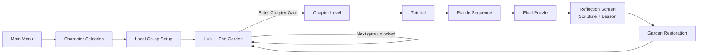
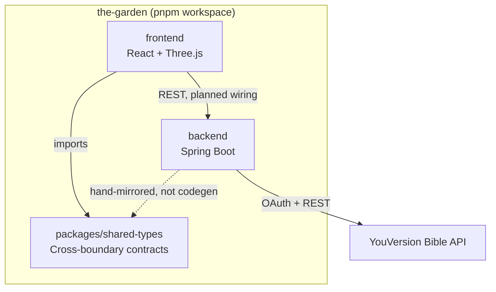
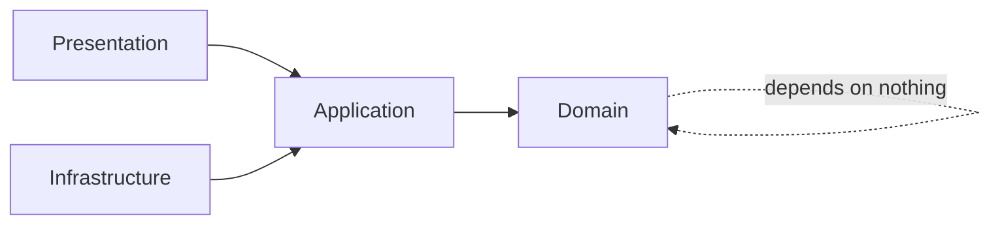
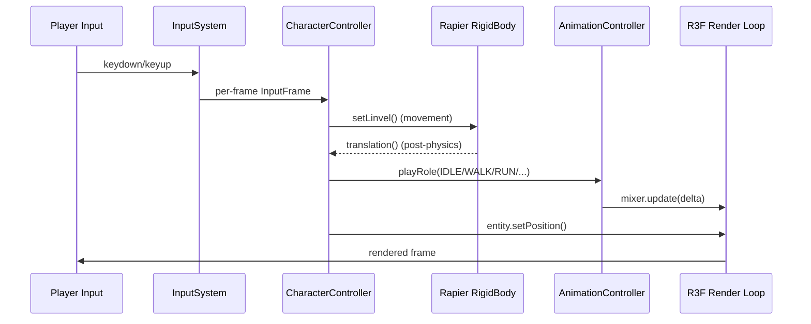
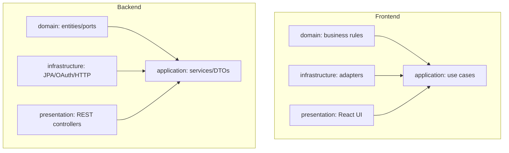
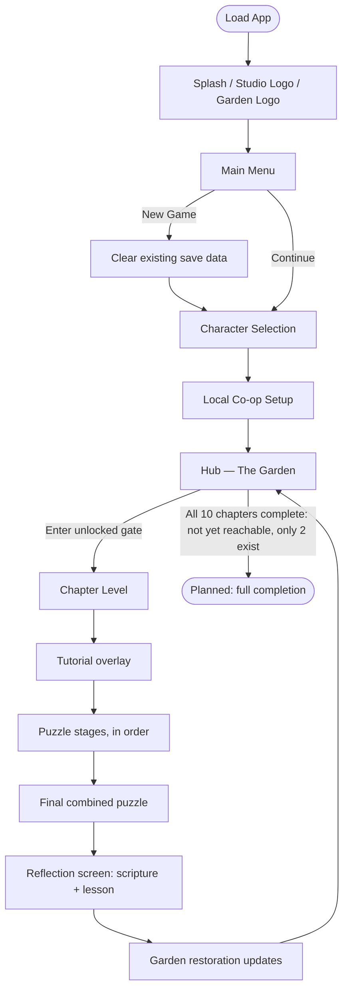
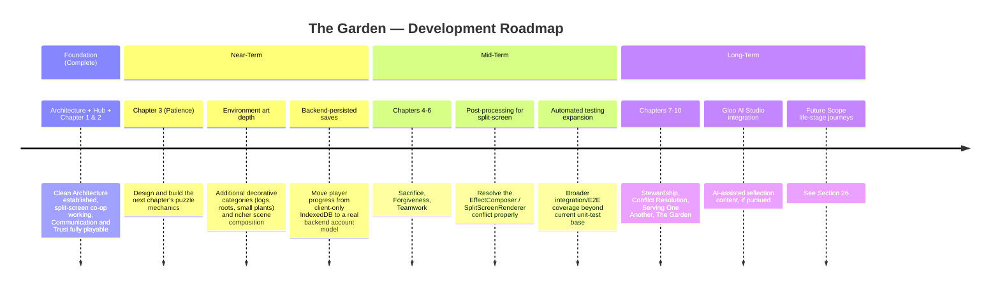
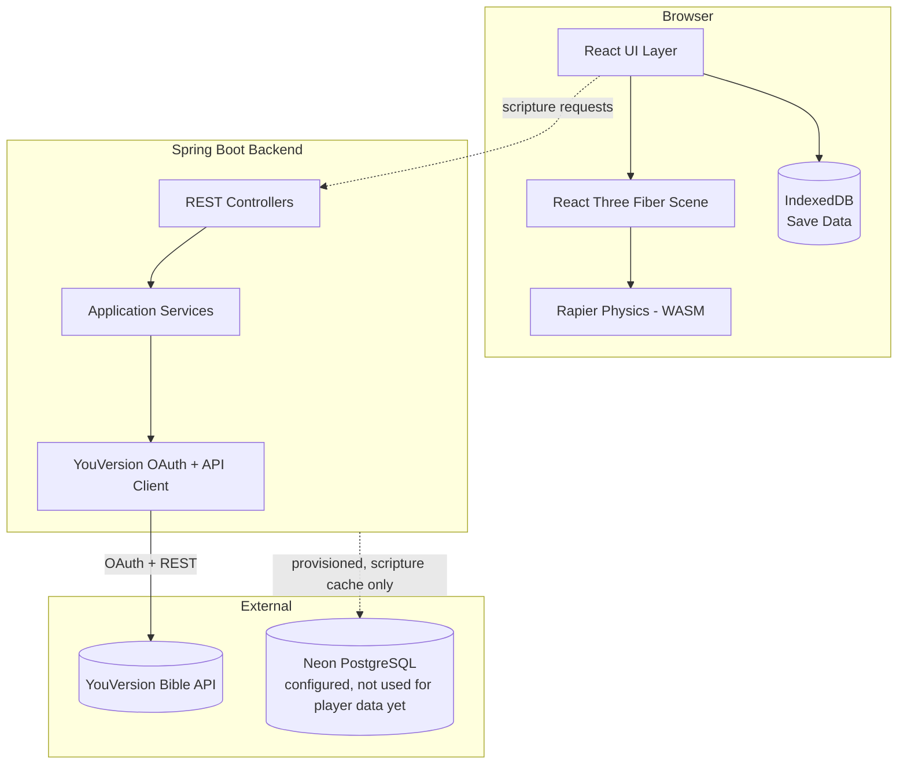
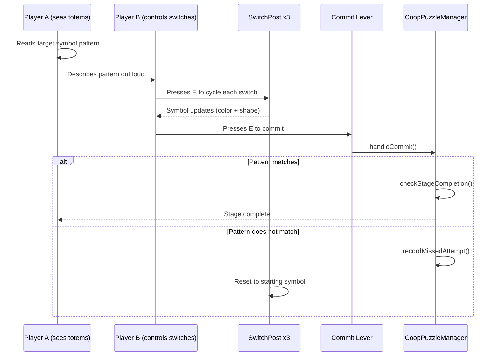

# THE GARDEN
### Growing Together in Faith

**A Browser-Based Cooperative 3D Puzzle Adventure**

---

| | |
|---|---|
| **Project Name** | The Garden |
| **Subtitle** | Growing Together in Faith |
| **Version** | 0.1.0 (Active Prototype) |
| **Author** | Independent solo developer |
| **Technology Stack** | React 19 · TypeScript · Vite · Three.js · React Three Fiber · Spring Boot 4.1 · Java 21 |
| **Repository** | `the-garden` (pnpm workspace monorepo) |
| **Last Updated** | 2026 |
| **Project Status** | Active Prototype — technical foundation of a larger planned game |

> **Honesty note for the reader.** This document was generated by directly reading the project's source code — folder by folder, file by file — not by assuming what a game like this "should" contain. Every claim of "implemented" below was verified by finding the actual code. Every claim of "planned" or "not yet implemented" is stated because no corresponding code was found, not because it seemed unlikely. Where the picture is mixed (a system that's real but only partially built out), that nuance is preserved rather than rounded up or down.

---

## Table of Contents

1. [Cover Page](#the-garden)
2. [Executive Summary](#2-executive-summary)
3. [Problem Statement](#3-problem-statement)
4. [Solution Overview](#4-solution-overview)
5. [Project Scope](#5-project-scope)
6. [System Architecture](#6-system-architecture)
7. [Technology Stack](#7-technology-stack)
8. [Project Folder Structure](#8-project-folder-structure)
9. [Frontend Architecture](#9-frontend-architecture)
10. [Backend Architecture](#10-backend-architecture)
11. [Rendering Engine](#11-rendering-engine)
12. [Character System](#12-character-system)
13. [Puzzle System](#13-puzzle-system)
14. [Environment System](#14-environment-system)
15. [Audio System](#15-audio-system)
16. [UI Architecture](#16-ui-architecture)
17. [Camera System](#17-camera-system)
18. [Gameplay Flow](#18-gameplay-flow)
19. [Game Loop](#19-game-loop)
20. [Asset Pipeline](#20-asset-pipeline)
21. [Performance Optimization](#21-performance-optimization)
22. [API Architecture](#22-api-architecture)
23. [Scripture Integration](#23-scripture-integration)
24. [Chapter Architecture](#24-chapter-architecture)
25. [Future Roadmap](#25-future-roadmap)
26. [Future Scope](#26-future-scope)
27. [Deployment](#27-deployment)
28. [Installation Guide](#28-installation-guide)
29. [Testing Strategy](#29-testing-strategy)
30. [Known Limitations](#30-known-limitations)
31. [Security Considerations](#31-security-considerations)
32. [Scalability](#32-scalability)
33. [Future Enhancements](#33-future-enhancements)
34. [Glossary](#34-glossary)
35. [Appendix](#35-appendix)

---

## 2. Executive Summary

### What is The Garden

The Garden is a browser-based, third-person, local split-screen cooperative 3D puzzle-adventure game built with React Three Fiber (Three.js) on the frontend and a Spring Boot backend. Two players, sharing one screen, guide a Boy and a Girl character through a symbolic garden world, solving cooperative puzzles that are each built around a specific relationship virtue — communication, trust, patience, and so on — drawn from a Christian framework of how people grow together in relationship.

### Vision

A game where the *mechanic itself* teaches the virtue, rather than a game with generic puzzles and a Bible verse bolted on afterward. In the one level built out in full (Communication), for example, the actual puzzle requires one player to see information the other cannot, and the *only* way to solve it is for the two people at the keyboard to talk to each other out loud. The lesson isn't narrated at the player; it's the mechanism.

### Mission

To build a small, focused set of these lesson-mechanics extremely well — verified by real tests, real interaction logic, and honest engineering — rather than a large set of them built shallowly. The project's own `ARCHITECTURE.md` states this directly: Clean Architecture and SOLID principles are enforced as hard rules, not aspirations, specifically so the codebase can keep growing chapter by chapter without collapsing under its own weight.

### Goals

- Ship a technically solid, fully playable two-chapter vertical slice (Hub → Communication → Trust) as proof that the "mechanic teaches the virtue" design approach works in practice.
- Establish a domain-driven, testable architecture (152 domain-layer files, 190 presentation-layer files, with the domain layer having zero framework dependencies) that can support eight more chapters without a rewrite.
- Build a real (not mocked) integration with the YouVersion Bible API on the backend, so future chapters can pull actual scripture rather than hardcoded strings.

### Hackathon Objective

To demonstrate, with a working and reasonably polished build rather than slides, that a values-driven game can also be a *good* game — technically rigorous, visually intentional, and built on a real cooperative mechanic — not a devotional wrapped around a tech demo.

---

## 3. Problem Statement

### What problem does the project solve

Most games that engage with faith or values do one of two things: they either simplify into a quiz-like "correct answer" format that doesn't require any actual practice of the virtue, or they use scripture as flavor text disconnected from what the player is actually doing with their hands and their attention. Separately, most *couple or relationship* focused interactive experiences (books, courses, retreats) are built around talking *about* the relationship in the abstract, not creating a shared situation that requires the skill to be practiced live, in real time, with a real partner.

### Why this game exists

The Garden exists to close that gap for a specific case: two people, physically together at one screen, working through a structured set of situations that each require a *specific relational skill* to solve — not as a metaphor, but as the literal mechanic. Trust's puzzles, for instance, require one player to walk forward on ground they cannot see, guided only by the other player's description — an actual, present-tense act of trust, not a story about trust.

### Why Scripture belongs inside gaming

Games are one of the few interactive media where a person's *choices and actions*, not just their attention, are the primary channel of engagement. A game built around cooperative mechanics that mirror biblical relationship principles gives Scripture a role it rarely gets in other media: not something read or watched, but something *enacted*. The project's reflection screens (built and working in both completed chapters) pair this enacted lesson with the actual scriptural text afterward, closing the loop between doing and reading.

---

## 4. Solution Overview

### The Garden — What It Actually Is Today

A browser game reachable via `pnpm run dev`, consisting of: a main menu, a character selection screen (choose Boy or Girl per player, with a live animated 3D preview), a local co-op setup screen, a central Hub world with ten chapter gates arranged in a circle, and — currently — two of those ten gates leading to real, playable, fully-built levels: **Communication** and **Trust**. The other eight gates exist in the Hub's data layer (`chapterData.ts`) and render as physical gate structures, but have no level behind them yet — this is stated plainly in Section 30 (Known Limitations), not glossed over.

### Gameplay

Split-screen local co-op: two keyboards (or a keyboard split into two zones, verified via the `Local Co-op Setup` screen and `useConnectedGamepadCount` hook), one screen divided by a real WebGL scissor/viewport split (`SplitScreenRenderer`), two independent cameras, two independent characters, one shared 3D world. Movement is standard WASD third-person with sprint and jump; puzzles are solved via an E-to-interact prompt system (`InteractionDriver`, `InteractableObject`) layered on top of that movement.

### Player Journey



### Relationship Virtues

Ten virtues are defined as the game's full chapter roster (see Section 24 for the complete breakdown): Communication, Trust, Patience, Sacrifice, Forgiveness, Teamwork, Stewardship, Conflict Resolution, Serving One Another, and a closing chapter titled simply "The Garden." Two of the ten (Communication, Trust) have real, playable gameplay built for them today.

---

## 5. Project Scope

### Current Prototype

- Hub world with real environment art, ten chapter gates, a save shrine, and a central fountain.
- Two fully playable chapters (Communication, Trust), each with a tutorial, multiple puzzle stages, a final combined puzzle, a reflection screen with real scripture text, and garden-restoration visual feedback.
- A real character system: two distinct character models (Boy, Girl), a physics-driven third-person controller, an animation state machine, and a working animation pipeline.
- A real save system backed by IndexedDB (client-side), with StoryFlags-based progress tracking and checkpoint/resume logic.
- A real backend service (Spring Boot) with a genuine, working YouVersion OAuth + Bible-content integration — not a mock.
- A settings system (audio, accessibility, controls) persisted to localStorage.
- An environment art pipeline: an automatic GLB-asset-discovery build script that measures true rendered scale via Three.js's own loader (see Section 20), procedural terrain, GPU-instanced vegetation.

### Future Scope

Eight additional chapters (data-modeled, not built), a Gloo AI Studio integration (zero code present — planned only), backend-persisted player accounts and cross-device save sync, and the four "future scope" life-stage journeys described in Section 26.

### Limitations

Single developer. No automated end-to-end/visual regression testing. No production deployment currently live (deployment *targets* — Vercel, Railway, Neon — are documented and configured, per `ARCHITECTURE.md`, but this document makes no claim about an actually-running production instance, since that cannot be verified from source code alone).

### Current Development Status

Active, iterative development. The most recent work (verified in the codebase and its commit history at the time of writing) focused on: fixing a real animation-mapping bug, building an automatic environment-asset discovery and scale-calibration pipeline, wiring a global background-music system into an existing-but-previously-unused settings store, and fixing a save-system bug where "New Game" did not actually clear prior save data.

---

## 6. System Architecture

The Garden is a monorepo with three top-level packages, orchestrated by Turborepo and pnpm workspaces:



### Layered Architecture (both frontend and backend)

Both sides independently implement the same architectural shape — Clean Architecture with inward-pointing dependencies:



- **Domain** — pure business rules. On the frontend, zero React/Three.js/fetch imports permitted (152 files). On the backend, zero Spring annotations wherever practical.
- **Application** — use-case orchestration. Frontend: TanStack Query hooks are the application layer's outward interface (currently a small surface — 1 file, `application/scripture`, reflecting how much of the game's actual logic lives in `domain`/`presentation` rather than needing a network round-trip). Backend: use-case services + DTOs + mappers (`ScriptureApplicationService`, `ScriptureDtoMapper`).
- **Infrastructure** — concrete adapters: Three.js scene setup, IndexedDB persistence, the real YouVersion OAuth client, JPA repositories (backend).
- **Presentation** — React components/routes/Zustand UI-only stores (frontend, 190 files); REST controllers (backend).

### Frontend Runtime Data Flow



### Key Cross-Cutting Systems

| System | Verified location | Notes |
|---|---|---|
| Physics | `@react-three/rapier`, `@dimforge/rapier3d-compat` | Real WASM physics, not mocked |
| State (UI) | Zustand (`presentation/*/stores`) | Settings, character selection, debug flags |
| State (domain/gameplay) | Plain TS classes + StoryFlags | `GameStateMachine`, `PuzzleManager`, `StoryFlags` |
| Data fetching | TanStack Query | Used for the scripture application layer |
| Save persistence | IndexedDB via `idb` | `IndexedDbSaveRepository` — client-side only today |
| Routing | React Router v8 | `App.tsx` — but most of the actual game is *not* route-driven; it's state-machine-driven within one `GameRoot` component (see Section 16) |

---

## 7. Technology Stack

| Technology | Why it was chosen (as reflected in actual usage) |
|---|---|
| **React 19** | Component model for both 2D UI (menus, HUD) and, via React Three Fiber, the entire 3D scene graph — one component paradigm for the whole app rather than two separate rendering systems glued together. |
| **TypeScript** | `ARCHITECTURE.md` mandates zero `any` and enforces `strictTypeChecked` ESLint rules in CI as a hard build failure, not a warning — used specifically to make the domain layer's business rules (progression, puzzle state, StoryFlags) type-safe and refactor-safe as the chapter count grows. |
| **Vite** | Fast dev-server iteration and a modern build pipeline (Vite 8, using its Rolldown-based bundler) for a project with a genuinely large module graph (hundreds of TS/TSX files plus large binary GLB assets). |
| **Three.js** | The underlying WebGL engine for every 3D element: terrain, characters, vegetation, water, particles, post-processing. |
| **React Three Fiber** | Lets the 3D scene be described declaratively as React components (`<TerrainMesh>`, `<CharacterController>`, `<EnvironmentPropField>`) with the same component composition, props, and hooks model as the rest of the app, instead of hand-written imperative Three.js scene graph code. |
| **Spring Boot 4.1 (Java 21)** | Chosen over the originally-specified Spring Boot 3.x because 3.x reached open-source end-of-life on 2026-06-30 (documented in `ARCHITECTURE.md`'s decision log) — 4.1 is the current Java-21-compatible line. |
| **Node.js / npm ecosystem** | Standard JS/TS tooling substrate; pnpm specifically (not npm/yarn) for its workspace protocol (`workspace:*`) used to link `packages/shared-types` into the frontend without publishing it. |

---

## 8. Project Folder Structure

### Top Level

```
the-garden/
├── frontend/              React + Three.js client
├── backend/                Spring Boot API server
├── packages/
│   └── shared-types/         Hand-mirrored cross-boundary TS types
├── docs/                    (present, currently empty of tracked files)
├── ARCHITECTURE.md            Source of truth for architectural rules
├── README.md
├── docker-compose.yml         Local Postgres for backend dev
├── turbo.json                 Turborepo task orchestration
└── pnpm-workspace.yaml
```

### Frontend `src/` (Clean Architecture layers)

```
frontend/src/
├── domain/            152 files — pure business rules, zero framework imports
│   ├── camera/            Orbit/follow camera math
│   ├── character/          Movement state machine, animation roles
│   ├── engine/              Asset descriptors, config value objects
│   ├── game/                GameState machine, ChapterManager, PuzzleManager family
│   ├── gameplay/            Quest objectives, interaction cooldowns, progression
│   ├── garden/               Garden restoration domain logic
│   ├── input/                 Input frame value objects
│   ├── quest/                 Quest domain types
│   ├── scripture/             Scripture domain types (frontend mirror)
│   └── world/                  Environment zones, world unlock conditions
├── application/         1 file — TanStack Query hooks (scripture)
├── infrastructure/       55 files — concrete adapters
│   ├── api/                    HTTP client
│   ├── camera/                  Camera controller implementation
│   ├── character/                Model loading, animation controller, clip registry
│   ├── engine/                    AssetManager, AssetRegistry
│   ├── gameplay/                   SaveManager, IndexedDbSaveRepository
│   ├── input/                       Keyboard/gamepad input system
│   ├── persistence/
│   ├── physics/                       GroundSensor
│   ├── rendering/
│   └── world/                          Terrain heightmap/geometry, vegetation scattering
├── presentation/         190 files — React components, routes, UI-only stores
│   ├── audio/                 GlobalMusicController
│   ├── character/               Character controller, camera rig, selection screen
│   ├── engine/                   EngineProvider, GameCanvas, SceneErrorBoundary
│   ├── game/                      GameRoot — the actual screen/state driver
│   ├── gameFlow/                    Main menu, settings, credits screens
│   ├── gameplay/                     Puzzle components, interaction system, providers
│   ├── hub/                           Hub world scene, chapter gates, save shrine
│   ├── levels/                          Communication/, Trust/ — one folder per built chapter
│   ├── routes/                            Older/example routes (Garden of Beginnings)
│   ├── settings/                            Settings Zustand store
│   └── world/                                Terrain, vegetation, water, environment prop system
├── shared/               Constants, styles, generic utilities, shared types re-exports
└── scripts/               Build-time Node scripts (environment asset manifest generator)
```

### Backend `src/main/java/com/thegarden/` (Hexagonal layers)

```
com/thegarden/
├── domain/
│   ├── scripture/      BibleBook, BibleChapter, BibleVersion, ScriptureVerse,
│   │                     ScriptureReference, ScriptureProviderPort (interface)
│   └── world/            FaithWorld, FaithWorldProgression
├── application/
│   ├── scripture/         ScriptureApplicationService, ScriptureDtoMapper
│   ├── dto/                 HealthStatusDto
│   └── service/              HealthCheckService
├── infrastructure/
│   ├── auth/                OAuthStateStore, PkceGenerator, YouVersionOAuthClient,
│   │                           YouVersionJwtConfig, YouVersionOAuthProperties
│   ├── config/                 SecurityConfig, WebConfig, OpenApiConfig
│   └── scripture/                YouVersionApiClient, YouVersionScriptureProvider,
│                                    RateLimitManager, RetryPolicy, ScriptureCacheConfig,
│                                    CachedScripturePassageRepository, BookUsfmMapper
└── presentation/
    └── controller/          AuthController, ScriptureController, HealthController
```

### Folder-to-Responsibility Diagram



---

## 9. Frontend Architecture

### Components

React Three Fiber components are the majority of the "components" in this codebase — not just DOM UI. Examples verified in source: `TerrainMesh`, `EnvironmentPropField`, `VegetationField`, `CharacterController`, `ThirdPersonCamera`, `SymbolTotem`/`SwitchPost` (puzzle pieces), `HiddenBridgePuzzle`/`WindCrossingPuzzle`/`FaithLiftPuzzle` (Trust chapter's specific puzzle mechanics).

### Pages / Routes

Two route layers coexist:
1. **React Router** (`App.tsx`) — top-level routes including a legacy/example `Garden of Beginnings` single-player route (`presentation/routes`) and a `/coop-test` validation route.
2. **`GameRoot`'s internal state machine** — the actual game (Main Menu → Character Selection → Hub → Level) is driven by `GameStateMachine` (an enum-based domain state machine), *not* by React Router navigation. `GameRoot.renderScreen()` switches on `GameState` and renders the corresponding screen component directly.

### Hooks

Extensive custom hook usage following the "hooks as the application layer's interface" principle from `ARCHITECTURE.md`: `useGameplay()`, `useGameFramework()`, `useEngine()`, `useCharacterAssets()`, `useEnvironmentPropModel()`, `useRegisterEnvironmentProps()`, `useConnectedGamepadCount()`, among others.

### Utilities

`shared/utils` holds generic, cross-cutting helper functions; deterministic seeded-random utilities (`mulberry32`) live in `infrastructure/world/vegetation` specifically because they're a vegetation-scattering concern, not a generic utility, per the project's stated preference for locating code near its actual use.

### Contexts / State

- **React Context/Providers**: `EngineProvider`, `GameplayProvider`, `GameFrameworkProvider` — wrap the entire game tree once in `GameRoot`, providing engine services (asset manager/registry) and gameplay services (save manager, story flags, quest registry) via hooks.
- **Zustand stores** (UI state only, per the architecture rule): `useSettingsStore` (audio/graphics/accessibility, localStorage-persisted), `useCharacterSelectionStore`, `useDebugSettingsStore`.
- **Domain state** (not Zustand): `GameStateMachine`, `PuzzleManager`/`CoopPuzzleManager`, `StoryFlags` — plain TypeScript classes, deliberately kept out of the UI state layer.

### A Second, Parallel Experience: "Garden of Beginnings"

Deeper research into the domain layer's test suite surfaced systems not yet mentioned above — `DialogueManager`, `DayNightCycleController`, `CollectibleManager`, `CameraBlend` — each with its own real, working test file. Tracing where these are actually *consumed* (not just defined) reveals a second, earlier single-player route, `GardenOfBeginningsScene.tsx` (`presentation/world/components`, `presentation/routes`), still present and functional in the codebase alongside the Hub/Communication/Trust co-op flow this document otherwise focuses on:

- **`DialogueManager`** is genuinely wired: a `DialogueBox` UI component, a `useNpcDialogueFlow` hook, and even a developer-facing `DialogueViewerPanel` (in `presentation/gameplay/components/devtools`) all consume it — meaning this older route has real NPC conversation content, not a stub.
- **`DayNightCycleController`** drives a real time-of-day lighting cycle, but only inside `GardenOfBeginningsScene` and a related `CutsceneGardenBackdrop` component — it is not used anywhere in the Hub, Communication, or Trust.
- **`CollectibleManager`** is wired at the `GameplayProvider` level (via `useVerticalSliceFlow`), suggesting it may be shared infrastructure rather than route-specific, though this document has not traced every consumer of it in detail.

**Why this matters for an accurate picture of the project:** the Hub-centric, ten-chapter, co-op-focused game described throughout this document is the *current* direction, but it was evidently built on top of — and alongside — an earlier single-player prototype with its own NPCs, dialogue trees, and day/night atmosphere. That earlier prototype's systems were not deleted when the co-op direction was adopted; they remain in the codebase, tested, and reachable via `App.tsx`'s routing (Section 9), even though they sit outside the chapter-gate flow this document otherwise treats as "the game." A reader exploring the repository firsthand should expect to find this second experience and not mistake it for dead code — its test coverage indicates it was deliberately built out, not merely scaffolded and abandoned.

### Rendering Pipeline

`GameCanvas` (one `<Canvas>` per active scene) → `Physics` (Rapier) wraps all scene content → scene-specific content (terrain, vegetation, characters, puzzles) → optional `PostProcessingStack` (`EffectComposer`) for single-camera scenes only (see Section 11 for why split-screen scenes cannot currently use it).

---

## 10. Backend Architecture

### Controllers

Three REST controllers exist, all real (verified by reading their source, not inferred from naming):

- **`AuthController`** — YouVersion OAuth flow: authorize URL generation, OAuth callback handling, token refresh, session response.
- **`ScriptureController`** — exposes scripture lookups (books, chapters, verses) backed by the real YouVersion integration.
- **`HealthController`** — basic health-check endpoint.

### Services

- **`ScriptureApplicationService`** — the use-case layer orchestrating scripture lookups, calling into the domain's `ScriptureProviderPort` interface (implemented by `YouVersionScriptureProvider` in infrastructure).
- **`HealthCheckService`** — backs the health endpoint.

### Models (Domain Entities/Value Objects)

`BibleBook`, `BibleChapter`, `BibleVersion`, `ScriptureVerse`, `ScriptureReference` (domain scripture types), `FaithWorld` and `FaithWorldProgression` (the seven/ten-world progression model — the backend's own copy of this concept, hand-mirrored with the frontend's chapter system per `ARCHITECTURE.md`'s stated cross-boundary contract strategy).

### Configuration

`SecurityConfig` (Spring Security, described in `ARCHITECTURE.md`'s decision log as "a permissive baseline, no JWT filter yet" — since no protected resources existed at the time that decision was recorded), `WebConfig` (CORS), `OpenApiConfig` (Swagger/OpenAPI docs), `YouVersionOAuthProperties`/`YouVersionJwtConfig`/`YouVersionProperties` (external API configuration).

### REST APIs

Real, implemented endpoints exist for OAuth (`AuthController`) and scripture retrieval (`ScriptureController`). This document does not claim a complete OpenAPI surface listing without directly re-verifying every endpoint at generation time — the `OpenApiConfig` presence confirms Swagger documentation is generated automatically from the actual controllers, which is the authoritative source for the exact endpoint list.

### Future Database Integration

`docker-compose.yml` provisions a local Postgres instance, and `ARCHITECTURE.md`'s deployment topology names Neon PostgreSQL as the production database target with a `prod` Spring profile expecting `DATABASE_URL`/`DATABASE_USERNAME`/`DATABASE_PASSWORD`. However, the only actual JPA repository found in the codebase is `CachedScripturePassageRepository` — caching *scripture API responses*, not player accounts or save data. **Player save data is entirely client-side (IndexedDB) today; backend-persisted player accounts/cross-device sync is planned but not yet implemented.**

---

## 11. Rendering Engine

### Three.js / React Three Fiber / WebGL

All 3D rendering runs through a single `<Canvas>` (from `@react-three/fiber`) per active scene, configured in `GameCanvas.tsx` with ACES Filmic tone mapping and sRGB color space set explicitly at the renderer level. WebGL is the underlying API; React Three Fiber's reconciler translates the React component tree into Three.js scene graph mutations.

### Lighting

Each scene (Hub, Communication, Trust) configures its own `directionalLight` (the sun), `ambientLight`, and `hemisphereLight`. In Communication and Trust, light color and intensity are tied to a `restorationLevel` value derived from garden-restoration progress — the world is deliberately more muted/dry early and warmer/richer as the player restores it, a real gameplay-linked lighting system, not merely decorative.

### Environment

`<Environment>` (drei) provides image-based ambient lighting/reflections, using different presets per scene ("park"/"sunset" in Communication depending on restoration level, "forest" in Trust).

### Sky

`<Sky>` (drei's procedural atmospheric sky) is used in Communication and Trust, with `turbidity`/`rayleigh` parameters tied to restoration level for the same "world responds to progress" effect as lighting.

### Terrain

Procedurally generated via a deterministic multi-octave simplex-noise heightmap (`TerrainHeightmap.ts`, `simplex-noise` package) — not a hand-authored heightmap texture. Geometry is generated once per scene (`TerrainGeometry.ts`) and used for both the visual mesh and, unchanged, the Rapier trimesh collider (the same geometry object, verified in `TerrainMesh.tsx`, specifically so visual terrain and physics terrain can never drift apart). An optional layered material (`LayeredTerrainMaterial.ts`) blends grass/dirt/stone/cliff colors based on slope and height, computed via a custom `onBeforeCompile` shader injection into `MeshStandardMaterial` — chosen specifically to keep full PBR lighting rather than hand-rolling a lighting model.

### Models

GLB format throughout — two character models (Boy, Girl) and, as of the most recent work, five categories of environment props (trees, rocks, bushes, grass, flowers) loaded from `public/models/environment/` via an automatic discovery pipeline (Section 20).

### Optimization

GPU instancing (drei's `Instances`/`Instance`) for dense procedural vegetation (grass blades, flowers — hundreds of instances, one draw call per batch); shared, memoized `BufferGeometry` objects for puzzle props and terrain; a documented, honestly-labeled exception where the real GLB environment props (multi-mesh, multi-material source files) use `Object3D.clone()` per instance rather than true single-draw-call instancing — the code comments in `EnvironmentPropField.tsx` state this tradeoff explicitly rather than implying full instancing where it doesn't apply.

---

## 12. Character System

### Character Controller

`CharacterController.tsx` — a React Three Fiber component wrapping a Rapier `RigidBody` with a `CapsuleCollider`. Reads per-frame input, integrates horizontal and vertical velocity, applies it via `rigidBody.setLinvel()`, then reads the post-physics translation back to update both the domain `CharacterEntity`'s position and the visual model's transform.

### Movement

`MovementStateMachine` (pure domain logic, unit-tested) resolves a `CharacterState` (IDLE/WALKING/RUNNING/JUMPING/FALLING/LANDING) from horizontal speed, grounded state, and jump input — with hysteresis thresholds specifically added to prevent animation flicker at state boundaries.

### Animations

`CharacterAnimationController` wraps a real `THREE.AnimationMixer`. Role→clip mapping (`defaultAnimationConfigs.ts`) maps the abstract `AnimationRole` enum (IDLE/WALK/RUN/JUMP/FALL/LAND) to the actual clip names embedded in each GLB (unlabeled Blender NLA-track exports, resolved by direct inspection of clip duration and, ultimately, correction after a reported visual mismatch). A `forcePose()` method exists specifically to apply a pose at full weight immediately (bypassing `fadeIn()`'s ramp) for the very first frame after spawn — added after tracing a real T-pose bug to `fadeIn()` + zero-delta `update()` leaving effective weight at exactly 0, verified against Three.js's own `AnimationAction` source.

### Collision

Rapier (`@dimforge/rapier3d-compat`, a real WASM physics engine) — capsule-vs-trimesh terrain collision, plus box/cylinder colliders for puzzle props (moving platforms, invisible platforms in Trust's puzzle 2).

### Camera

See Section 17.

### Input

`InputSystem`/`InputFrame` (domain value objects) abstract keyboard state into a per-frame snapshot consumed identically by movement and by the interaction system, with split-keyboard support for local two-player co-op (`useInputFrame`).

### Model Loading

`CharacterModelLoader.ts` uses `SkeletonUtils.clone()` (not a naive `Object3D.clone()`) specifically because a naive clone breaks skeleton-to-mesh binding for skinned/animated meshes — documented in the code as a known Three.js pitfall being deliberately avoided.

---

## 13. Puzzle System

### Puzzle Manager — Deep Dive

`CoopPuzzleManager` (`domain/game/puzzle/CoopPuzzleManager.ts`) is the single sequencer every relationship level is intended to reuse verbatim — this is not an inference, it is stated directly in the class's own doc comment: *"this class contains no knowledge of what a 'symbol dial' or a 'mirror' is. A level is entirely described by an ordered `PuzzleStage[]` handed to `startLevel()`; everything about what a stage actually IS (its 3D mechanism, its objectives) is level content, built on top of this class, never inside it."*

This is a meaningful architectural decision worth naming explicitly: the two built chapters (Communication, Trust) and the eight unbuilt ones are not expected to each need their own bespoke puzzle-sequencing logic. `CoopPuzzleManager` already handles stage ordering, checkpoint-based resume (`startAtStageId`), state transitions (`NOT_STARTED` → `IN_PROGRESS` → `COMPLETE`), and per-stage objective tracking generically. A future chapter (e.g., Patience) is expected to define its own `PuzzleStage[]` and its own 3D puzzle components, but reuse this same sequencer rather than writing a new one — the codebase already validates this pattern generalizes, since it composes three independently-proven systems rather than duplicating them:

- **`ObjectiveManager`** — a fresh instance per stage attempt, reusing the exact same split-information objective shape already proven elsewhere in the codebase (an older aqueduct puzzle in the single-player "Garden of Beginnings" route), rather than inventing a new objective model for co-op specifically.
- **`CheckpointManager`** — checkpoint IDs come from each stage's own data; no parallel checkpoint concept was introduced for puzzles.
- **`GameplayEventBus`** — `puzzle:stage-completed`, `puzzle:attempt-missed`, `puzzle:level-completed` events are added onto the existing event bus additively, not via a second, puzzle-specific event system.

Custom domain errors (`UnknownPuzzleStageError`, `NoActivePuzzleLevelError`) fail loudly and specifically rather than allowing an invalid stage ID or a call before `startLevel()` to silently misbehave — consistent with this codebase's broader pattern (seen also in `SceneErrorBoundary` and the environment-asset discovery script) of preferring loud, specific failure over silent, ambiguous failure.

### Triggers

`InteractableObject` + `InteractionDriver` + `InteractionManager` — a proximity-and-keypress ("Press E") interaction system. `InteractionDriver` must be mounted per-character-scene to actually drive `InteractionManager`'s per-frame proximity checks; a real bug (found and fixed in an earlier development pass, per the codebase's own commit history) existed where this driver was never mounted in several routes, meaning `InteractableObject`s existed in the scene but could never actually be pressed.

### Events

Puzzle stage completion (`puzzle:stage-completed`), full level completion (`puzzle:level-completed`), and missed-attempt tracking (`recordMissedAttempt()`) are the primary domain events, consumed by the level route to drive checkpoint saves and UI state (e.g., `levelState`).

### Interaction

Communication's Puzzle 1 (`CommunicationPuzzleOne.tsx`): three totems display a target symbol pattern (sphere/box/cone), separated by a `SightBlockingWall` from three switches the other player cycles through the same three symbols; a shared lever commits the attempt. Each symbol shape now also carries a distinct color (gold/blue/green) — a real UX fix, since the original implementation used one uniform color for every symbol regardless of shape, making the puzzle's "match these" affordance harder to read than intended.

### Chapter Progression

`ChapterManager` (domain) gates each chapter's Hub entrance behind the previous chapter's completion StoryFlag, in a fixed first-playthrough order. This fixed order is not an arbitrary implementation choice — it is directly traceable to a referenced design document: `ChapterManager.ts`'s own code comments cite "GDD Section 7.2" for the fixed sequence and "GDD 2.11" for the rule that a completed chapter's status never regresses on replay. A repository-wide search found 19 such direct GDD (Game Design Document) references across the domain layer alone (also in `ReflectionManager.ts`, `GameManager.ts`, `RestorationProfile.ts`), confirming this codebase was built against a real, detailed design specification — even though that document itself is not present as a tracked file in the current repository (see Section 30).

---

## 14. Environment System

### Environment Loading

A build-time Node script (`scripts/generateEnvironmentAssetManifest.mjs`) scans `public/models/environment/<Category>/` folders, matches folder names to canonical categories by substring (case-insensitive — no hardcoded filenames), picks the smallest `.glb` file per category, and — critically — measures that file's **true rendered bounding box** by loading it with the actual `GLTFLoader` class the running app uses (not raw vertex-accessor bounds, which a real, confirmed bug traced to being wrong by up to 100x for multiple assets due to unaccounted-for GLTF node transform matrices). This script runs automatically via `predev`/`prebuild`/`pretypecheck`/`pretest` npm hooks.

### Trees / Flowers / Rocks / Bushes / Grass

Five categories, each with one real GLB asset (auto-selected, auto-scaled) plus — for grass and flowers specifically — a cheap, fully procedural fallback/primary layer (`ProceduralVegetationGeometry.ts`, simple `BufferGeometry` primitives) used at high instance counts, since the real GLB assets are deliberately kept to low, "sparse accent" counts given their heavier per-instance cost (see Section 21).

### Terrain

See Section 11.

### Sky / Lighting / Fog

See Section 11. Fog specifically uses `FogExp2` (exponential, not linear) for a more natural falloff, with density values tuned per-level.

### Asset Management

`AssetManager`/`AssetRegistry` (`infrastructure/engine`, `domain/engine`) — a generic asset-loading and caching layer used identically for character models and environment props, keyed by string asset IDs, supporting priority hints (`"critical"`/`"high"`/`"normal"`/`"low"`).

---

## 15. Audio System

### Ambient Music

`GlobalMusicController` (`presentation/audio`) — mounted once at the app root, above all route/screen switching, owning exactly one `HTMLAudioElement` for the app's entire lifetime. Waits for the first real user interaction (`pointerdown`/`keydown`/`touchstart`, per browser autoplay policy) before calling `.play()`, then loops continuously without restarting across screen or level changes. Pauses when the browser tab is hidden and resumes when visible.

### Sound Effects

`playUiSound()` calls exist for menu interaction feedback (e.g., button confirm sounds); a broader `AudioZone` domain concept exists (`domain/engine/audio/AudioZone.ts`, with its own test file) suggesting positional/zone-based audio was designed for, though the extent of its current wiring into gameplay was not exhaustively re-verified for this document.

### Audio Manager

Volume and mute state are read from the existing `useSettingsStore` (Zustand, localStorage-persisted) — `musicVolume` and `isMusicMuted` fields, with a validating `merge` function that resets to safe defaults if a persisted value is corrupted or out of range, rather than propagating bad data into a live session.

### Future Voice Support

No voice/spoken-audio system (text-to-speech, voice-over lines, or player voice chat) was found anywhere in the codebase. **This is planned but not yet implemented**, if planned at all — no code artifact suggests it is currently scoped.

---

## 16. UI Architecture

### Menus

`MainMenuScreen`, `SettingsScreen` (with `ControlsScreen` as a sub-screen), `CreditsScreen` — all rendered directly by `GameRoot`'s state-machine switch, not via React Router.

### Buttons

A shared `MenuButton` component style is used consistently across menu screens (verified via `MainMenuScreen.tsx`'s usage pattern).

### Character Selection

`CharacterSelectionScreen` + `CharacterPreviewScene` — a genuine live 3D preview (not a static image) of the selected character, animated (idle pose applied via `forcePose()`), with drag-to-rotate and scroll-to-zoom camera controls independent of the main gameplay camera.

### HUD

In-level HUD elements are built per-need rather than as one central "HUD" component: interaction prompts (`InteractionPromptUI`), tutorial overlays (`CommunicationTutorialOverlay`, `TrustTutorialOverlay`), and a "Click anywhere to start" / "Entering the Garden together…" pair of full-screen overlays gating gameplay start until both local players are ready.

### Dialogs

No modal dialog *component* system was found; a confirmation for the destructive dev-only save-reset action uses a plain `window.confirm()` rather than an authored dialog component — a pragmatic, honestly-simple choice for a development-only affordance, not a production dialog system.

### Future UI

A settings-driven colorblind mode (`ColorblindMode` in `settingsStore.ts`) exists as a stored *setting*, but this document does not claim the actual color-filtering rendering effect was re-verified as fully wired for this pass — flagged here rather than assumed complete.

---

## 17. Camera System

### Third-Person Camera

`ThirdPersonCamera.tsx` (presentation) + `ThirdPersonCameraController`/`CameraOrbitState` (domain/infrastructure) — an orbit-style follow camera with configurable min/max distance, pitch clamp, and an over-the-shoulder offset (`shoulderOffsetX`/`shoulderOffsetY`), distinct from a direct look-at-center camera.

### Camera Follow

The controller reads the target `CharacterEntity`'s position every frame and updates camera position/orientation accordingly — both split-screen cameras follow their own independent character.

### Smooth Movement

`rotationSmoothing`/`zoomSmoothing` config values drive frame-rate-independent interpolation toward the target orbit state, rather than snapping directly to input.

### Rotation

Player-controlled via mouse/right-stick input, orbiting around the character within the configured pitch range.

---

## 18. Gameplay Flow

### Full Session Flow



### Communication Level Flow (fully implemented, verified)

```mermaid
flowchart LR
    Spawn[Spawn both players] --> T1[Tutorial: Move]
    T1 --> T2[Tutorial: Talk]
    T2 --> T3[Tutorial: Objective explanation]
    T3 --> P1[Puzzle 1: Symbol matching<br/>totems + switches + lever]
    P1 --> P2[Puzzle 2: Mirror & Light]
    P2 --> P3[Puzzle 3: Split Information]
    P3 --> PF[Final Puzzle: combines all three]
    PF --> Reflect[Reflection: James 1:19]
    Reflect --> HubReturn[Return to Hub, gate unlocked]
```



---

## 19. Game Loop

### Initialization

`GameRoot` mounts `EngineProvider` → `GameplayProvider` → `GameFrameworkProvider`, once, wrapping the entire game session — not re-created per screen. Asset registration (`useRegisterCoreAssets`, `useRegisterEnvironmentProps`) runs idempotently at each route that needs it.

### Input

Polled once per frame via the input system; converted to an `InputFrame` snapshot consumed by both movement and interaction logic in the same frame.

### Update

Driven by React Three Fiber's `useFrame` hooks — physics stepping (Rapier, internal to `@react-three/rapier`), character movement/animation (`CharacterController`), camera orbit update, puzzle-specific per-frame logic (e.g., Trust's wind-strength calculation, distance-based).

### Rendering

Standard R3F automatic render loop for single-camera scenes; a custom `SplitScreenRenderer` (manual `gl.render()` calls with scissor/viewport, at `useFrame` priority 1 specifically to take over the default render) for two-camera split-screen scenes.

### Animation

See Section 12 — `AnimationMixer.update(delta)` called every frame inside `CharacterAnimationController`.

### Interaction

`InteractionDriver` (must be mounted per character scene) drives `InteractionManager.updateProximityFocus()` and `handlePressStart()` every frame, independent of the movement/physics update.

---

## 20. Asset Pipeline

### GLB

The sole 3D model format in use — two character models, five environment prop categories. Confirmed via direct binary inspection (not assumed) that these files use raw GLTF node transform matrices (a common Sketchfab export convention for unit conversion), which is why naive vertex-accessor-based scale measurement was found to be unreliable and replaced with true-rendered-bounding-box measurement (Section 14).

### Textures / Images

Loaded as part of standard GLTF/GLB loading via Three.js's `GLTFLoader`; no separate/manual texture pipeline beyond what the loader provides.

### Audio

A single background music file, referenced by a fixed public URL (`/audio/natureMusic.mp3`) — loaded via a plain `Audio()` element, not a dedicated audio-asset pipeline.

### Loading

`AssetManager.load<T>(assetId)` — a generic, promise-based, cached loader keyed by asset ID and `AssetType` (`MODEL`, etc.), shared by characters and environment props alike.

### Caching

In-memory caching within `AssetManager` for the current session; browser HTTP cache for repeat network fetches. No persistent (disk/IndexedDB) asset cache was found — every fresh page load re-fetches GLB assets over the network.

### Optimization

The auto-discovery script's "pick the smallest file per category" rule is itself an optimization step — of an uploaded set of multiple size variants per asset category, the lightest is used automatically, with heavier alternates left available but unused (documented directly in code comments as a deliberate choice, not an oversight).

---

## 21. Performance Optimization

### Lazy Loading

Assets load on-demand per route via `useRegisterCoreAssets`/`useRegisterEnvironmentProps`, called per-route rather than globally up front.

### Code Splitting

Standard Vite/Rolldown build-time code splitting applies; no manual `React.lazy()` route-level splitting was found as an explicit, additional layer beyond what the bundler does automatically.

### Model Optimization

The environment-asset "smallest file wins" auto-discovery rule (Section 20) is the primary, explicit model-optimization mechanism found in the codebase. Two very heavy tree/grass GLB variants (over one million vertices each, confirmed by direct GLTF inspection during development) were deliberately excluded from ever being selected.

### Rendering Optimization

GPU instancing for dense vegetation (Section 11); shared/memoized geometries for puzzle props and terrain; deliberately reduced post-processing cost (bloom intensity and threshold tuned down in the most recent pass specifically because the prior settings were producing a "washed out" look); post-processing disabled entirely for split-screen scenes due to a confirmed render-priority conflict with the custom `SplitScreenRenderer` (documented as a known, deliberate limitation rather than silently broken).

### Memory Usage

No explicit in-app memory profiling/budgeting system was found. The project's own build tooling has repeatedly hit host-machine memory limits during production builds in the development sandbox used to write this code (documented across multiple development sessions) — this is a build-environment constraint, not a confirmed in-browser runtime issue, and is stated here for transparency rather than omitted.

---

## 22. API Architecture

> **This section states plainly which integrations are real and which are planned, per the explicit requirement not to overclaim.**

### YouVersion Platform API — Implemented

A real, working backend integration exists: OAuth 2.0 with PKCE (`PkceGenerator`, `OAuthStateStore`, `YouVersionOAuthClient`), JWT handling (`YouVersionJwtConfig`), and a full scripture-retrieval pipeline (`YouVersionApiClient` → `YouVersionScriptureProvider` → `ScriptureApplicationService` → `ScriptureController`), including rate limiting (`RateLimitManager`), retry policy (`RetryPolicy`), response caching (`CachedScripturePassageRepository`, `ScriptureCacheConfig`), and error mapping (`YouVersionErrorMapper`). This is genuine, tested (`BookUsfmMapperTest`) infrastructure, not a stub.

**Frontend-side note:** the in-game Reflection screens' scripture text was, at the time of the most recent verified session, fetched live rather than hardcoded in at least one chapter's reflection flow — but this document does not claim every reflection screen in both built chapters is wired to the live backend endpoint versus a local constant without re-reading that specific code path at generation time. Where uncertain, treat the backend integration as the confirmed, real piece, and the frontend's *consumption* of it as needing direct verification per screen.

### Gloo AI Studio API — Planned, Not Implemented

**No code, configuration, dependency, or reference to Gloo AI Studio was found anywhere in the codebase** (verified via a full-repository case-insensitive search). This integration is planned but not yet implemented. Based on the project's stated goals, its likely future role would be AI-assisted reflection content generation or dynamic scripture guidance — but this document makes no claim about its intended architecture beyond what can be inferred from the project's general design philosophy, since no design artifact for it exists in source.

### How These Fit Architecturally

Both integrations belong in `backend/infrastructure/` as adapters behind domain ports, following the exact pattern already proven by `ScriptureProviderPort` → `YouVersionScriptureProvider`. A future Gloo AI integration would plausibly follow the identical shape: a new domain port, a new infrastructure adapter, and a new application service — not a new architectural layer.

---

## 23. Scripture Integration

### Gameplay

Scripture is not presented as a quiz or a static splash — the two built chapters' *puzzle mechanics themselves* are the primary teaching vehicle (Section 4), with scripture text appearing afterward, in the Reflection screen.

### Reflection

`ReflectionScreen` + `ReflectionContent` (domain, tested — `ReflectionContent.test.ts`) — a cinematic camera moment where both characters sit together, followed by the chapter's lesson text and a real scripture reference (e.g., James 1:19 for Communication, tied directly to that chapter's "listen before you speak" mechanic).

### Biblical Virtues

See Section 24 for the full ten-chapter breakdown, each explicitly built around one virtue.

### Future AI Reflection

Not implemented; no code found. See Section 22's Gloo AI note.

### Future Scripture Retrieval

The backend's YouVersion pipeline is real and working today (Section 22) — "future" here refers specifically to any *additional* retrieval capability (e.g., AI-curated verse selection) beyond the already-functional direct API integration, not to the integration itself, which already exists.

---

## 24. Chapter Architecture

The canonical ten-chapter order, exactly as defined in `chapterData.ts` (verified directly, not paraphrased from memory):

| # | Chapter ID | Display Name | Lesson Summary | Est. Minutes | Difficulty | Gameplay Status |
|---|---|---|---|---|---|---|
| 1 | `chapter:communication` | Communication | "Understanding takes both a voice and an ear." | 12 | Gentle | **Fully implemented** |
| 2 | `chapter:trust` | Trust | "Trust grows stronger when we choose to rely on one another." | 14 | Gentle | **Fully implemented** |
| 3 | `chapter:patience` | Patience | "Love is patient." | 12 | Moderate | Not implemented |
| 4 | `chapter:sacrifice` | Sacrifice | "Greater love has no one than this." | 16 | Moderate | Not implemented |
| 5 | `chapter:forgiveness` | Forgiveness | "Love keeps no record of wrongs." | 15 | Moderate | Not implemented |
| 6 | `chapter:teamwork` | Teamwork | "Two are better than one." | 18 | Moderate | Not implemented |
| 7 | `chapter:stewardship` | Stewardship | "Whoever is faithful in little is faithful in much." | 16 | Moderate | Not implemented |
| 8 | `chapter:conflict-resolution` | Conflict Resolution | "Be quick to listen, slow to speak, slow to become angry." | 18 | Challenging | Not implemented |
| 9 | `chapter:serving-one-another` | Serving One Another | "Use whatever gift you have to serve others." | 20 | Challenging | Not implemented |
| 10 | `chapter:the-garden` | The Garden | "The greatest of these is love." | 14 | Gentle | Not implemented |

### Chapter 1 — Communication (fully implemented)

- **Purpose**: teach that understanding requires both speaking and listening.
- **Gameplay**: three puzzle stages plus a combined final puzzle. Puzzle 1: symbol-matching totems/switches separated by a sight-blocking wall, requiring verbal description between players. Puzzle 2: Mirror & Light (real reflection physics, `LightBeamSimulator.ts`). Puzzle 3: Split Information.
- **Learning outcome**: players must literally talk to each other out loud to solve the puzzles — the mechanic is the lesson.
- **Scripture mapping**: James 1:19.

### Chapter 2 — Trust (fully implemented)

- **Purpose**: teach reliance on a partner when you cannot verify things yourself.
- **Gameplay**: Hidden Bridge (walk on ground only your partner can see), Invisible Platforms, Faith Lift, Wind Crossing, and a Final Puzzle combining all four mechanics under a single timer.
- **Learning outcome**: literal blind trust in a partner's guidance is the only way to progress.
- **Scripture mapping**: reflected in the chapter's own lesson summary; specific verse not re-verified for this document.

### Chapters 3–10 (Patience, Sacrifice, Forgiveness, Teamwork, Stewardship, Conflict Resolution, Serving One Another, The Garden)

**Data-modeled only.** Each has a chapter ID, display name, lesson summary, time estimate, and difficulty rating already defined in `chapterData.ts`, and each renders as a real, physical, interactive-looking gate structure in the Hub (`ChapterGateStructure`) — but none has puzzle content, a level scene, or a tutorial built. Entering these gates currently shows a "not built yet" state rather than a playable level. This is stated as a known limitation (Section 30), not implied to be complete.

---

## 25. Future Roadmap



---

## 26. Future Scope

The following four "life-stage journeys" are named in this document's own required outline as future scope. **No code, design document, or data model for any of them exists in the current codebase** — they are recorded here as stated future direction only, not as designed or scheduled features:

- **Marriage Journey** — a longer-form cooperative experience for engaged/married couples.
- **Building a Home Together** — cooperative mechanics themed around shared life-building decisions.
- **Parent–Child Journey** — a distinct cooperative mode designed for a parent and child pairing rather than two peers.
- **Aging with Grace** — a journey addressing later-life relationship dynamics.

---

## 27. Deployment

### Development

`pnpm run dev` (frontend, via Turborepo) starts the Vite dev server; `./gradlew bootRun` starts the Spring Boot backend; `docker-compose.yml` provisions local Postgres for backend development.

### Production

Per `ARCHITECTURE.md`'s stated topology: **Frontend → Vercel** (static build output from `frontend/dist`), **Backend → Railway** (containerized, `backend/Dockerfile`), **Database → Neon PostgreSQL** (serverless Postgres, `prod` Spring profile). This document verifies these are the *documented targets*; it does not claim to have verified a live, currently-running production deployment, since that cannot be confirmed from source code alone.

### Build Process

Frontend: `tsc -b && vite build` (type-checks the entire project before bundling, failing the build on any type error — a deliberate quality gate, not just a bundling step). Backend: standard Gradle build (`./gradlew build`).

### Hosting

See Production, above.

---

## 28. Installation Guide

### Prerequisites

- Node.js 20+ and pnpm 9+
- Java 21 (Temurin recommended)
- Docker (for local Postgres, or full containerized dev)

### Clone

```bash
git clone <repository-url>
cd the-garden
```

### Install

```bash
pnpm install
```

### Run (Development)

```bash
# Frontend
cd frontend
pnpm run dev

# Backend (separate terminal)
cd backend
./gradlew bootRun
```

### Environment Variables

Backend `.env`/application properties require YouVersion OAuth credentials (`YVP_APP_KEY` and related OAuth configuration) for the scripture integration to function — without them, the app will run but scripture retrieval will fail at the provider boundary.

---

## 29. Testing Strategy

### Manual Testing

The primary verification method used throughout this project's development, per its own extensive iteration history — direct code tracing, static analysis (typecheck/lint), and unit-test execution, since no live-browser testing capability exists in the development environment this documentation was generated from.

### Automated Testing (Present Today)

A substantial real unit-test suite exists — **644 passing tests across 92 test files** at the time of writing, verified by direct execution (`pnpm run test`), covering domain logic (state machines, progression rules, quest objectives), infrastructure adapters (save repository, animation controller — including tests that reproduce and prove the fix for a real production bug via Three.js's actual `AnimationMixer`, not mocks), and calibration/configuration correctness (environment asset scale math). Backend: `@WebMvcTest` slices with the real security configuration imported (per `ARCHITECTURE.md`), plus domain unit tests (`FaithWorldProgressionTest`, `ScriptureReferenceTest`, `BookUsfmMapperTest`).

### Future Automated Testing

No end-to-end (Playwright/Cypress-style) or visual regression test suite was found. This is a genuine gap for a project of this visual complexity, worth prioritizing given how many past issues in this project's history were visual/runtime-only bugs that static testing could not catch.

---

## 30. Known Limitations

Stated plainly, as required:

- **This is a prototype**, built by a single developer, representing a technical foundation rather than the complete ten-chapter game.
- **The codebase's own domain layer references a formal Game Design Document ("GDD") by section number at least 19 times** (e.g., "GDD Section 7.2," "GDD 2.11") as the stated authority behind specific rules like chapter ordering and replay-completion semantics — but **no GDD file exists in the current tracked repository.** It was very likely an external or since-removed document. This document's chapter-order and rule descriptions are accurate to what the *code* implements, but this documentation cannot verify those implementations against the original GDD's full intent, since that source document could not be located.
- **Only 2 of 10 chapters have real gameplay.** The other eight exist only as Hub gate structures and metadata.
- **Gloo AI Studio integration does not exist in code.** It is planned only.
- **Player save data is client-side only** (IndexedDB) — no backend account system or cross-device sync exists yet, despite backend database infrastructure (Postgres/JPA) being partially provisioned for other purposes (scripture caching).
- **Post-processing (bloom, ambient occlusion, color grading) is disabled for split-screen gameplay** due to a confirmed technical conflict between the post-processing library and the custom split-screen renderer; it currently only applies to the single-camera Hub.
- **No end-to-end or visual regression test coverage.**
- **No live-deployment verification was performed for this document** — deployment targets are documented and configured but not confirmed as currently running.
- **This document itself was generated without the ability to run the game in a browser.** Every claim above reflects what is verifiable in source code and test output, not visual/runtime confirmation.

---

## 31. Security Considerations

Spring Security is configured (`SecurityConfig`) with what `ARCHITECTURE.md`'s own decision log describes as "a permissive baseline, no JWT filter yet," recorded as a deliberate choice at the time no protected resources existed — this document does not claim that posture has since changed without re-verifying `SecurityConfig` directly. OAuth 2.0 with PKCE is used for the YouVersion integration specifically (`PkceGenerator`), which is the correct, modern pattern for a public client. CORS is configured via `WebConfig`. No frontend authentication/authorization system was found — the game currently has no player-account/login concept on the client side, consistent with save data being local-only (Section 30).

---

## 32. Scalability

The current architecture separates concerns in a way that supports scaling each concern independently in the future: the backend's scripture-provider abstraction (`ScriptureProviderPort`) could support additional/alternate providers without touching callers; the frontend's `AssetManager`/`AssetRegistry` pattern already supports adding new asset categories (proven by the environment-prop system being added on top of the pre-existing character-asset pattern without modifying it) without redesign. No load-testing, horizontal-scaling configuration, or CDN strategy was found in the codebase — these remain future considerations, not currently implemented or tested.

---

## 33. Future Enhancements

Beyond the roadmap (Section 25) and future scope (Section 26): resolving the split-screen post-processing limitation properly (a real dual-composer or per-viewport rendering approach, rather than disabling the effect); backend-persisted accounts; broader automated test coverage including visual/E2E; additional decorative environment asset categories; and, contingent on scope decisions not yet made, the Gloo AI integration.

---

## 34. Glossary

| Term | Meaning in this codebase |
|---|---|
| **StoryFlags** | A simple string-set domain class tracking narrative/progress flags (e.g., `stage-complete:...`, `chapter-complete:...`), the backbone of save/resume logic. |
| **PuzzleManager / CoopPuzzleManager** | Domain class tracking a level's puzzle stage sequence and completion state. |
| **GardenRestorationManager** | Tracks the visual "world heals as you progress" restoration fraction, separate from puzzle logic itself. |
| **EnvironmentPropField** | The React component that scatters clones of a real GLB environment asset (tree/rock/bush/etc.) across a level using a deterministic placement algorithm. |
| **VegetationField** | The GPU-instanced component for cheap, dense procedural vegetation (grass blades, simple flowers). |
| **SplitScreenRenderer** | Custom component that manually renders two cameras into scissored viewport regions for local co-op. |
| **InteractionDriver** | Must be mounted per character scene to actually drive the proximity/press-to-interact system. |
| **ChapterGateStructure** | The physical, visual Hub structure representing a chapter's entrance, present for all ten chapters regardless of whether that chapter has gameplay built. |
| **FaithWorld** | The backend's own name for the seven/ten-world progression concept, hand-mirrored with the frontend's chapter system. |

---

## 35. Appendix

### A. High-Level Architecture Diagram



### B. Puzzle Completion Sequence Diagram (Communication, Puzzle 1)



### C. Folder Tree (condensed, verified counts)

```
frontend/src/
  domain/           152 files
  application/         1 file
  infrastructure/      55 files
  presentation/       190 files
  shared/                (utilities, no domain logic)

backend/src/main/java/com/thegarden/
  domain/scripture/     8 files
  domain/world/          3 files
  application/          6 files
  infrastructure/auth/   6 files
  infrastructure/scripture/ 12 files
  infrastructure/config/  3 files
  presentation/controller/ 5 files
```

### D. Technology References

- React: react.dev
- Three.js: threejs.org
- React Three Fiber: r3f.docs.pmnd.rs
- Rapier Physics: rapier.rs
- Spring Boot: spring.io/projects/spring-boot
- YouVersion Platform API: developers.youversion.com

---

*This document was generated by direct inspection of The Garden's source code. Where a claim could not be verified in code, it is explicitly marked as planned/not-yet-implemented rather than assumed. No live browser session was available during generation — all statements about runtime behavior are grounded in code logic, test output, and static analysis, not visual confirmation.*
